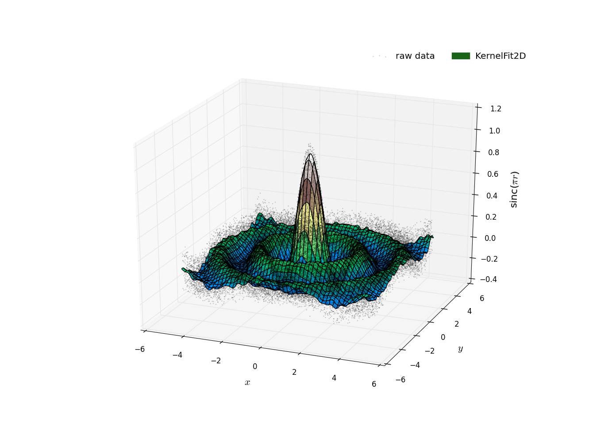

# KernelFit

C++ classes for single and multidimensional non-parametric Gaussian kernel
regression. These objects allow for the fitting of smooth profiles through
noisy data. The functions that solve for the profile are 
*embarrassingly parallel* and use OpenMP to gain large speedups.

**License:** 
[GNU General Public License, version 3](https://www.gnu.org/copyleft/gpl.html). 
See the LICENSE file.

**Dependencies:**
STL and OpenMP

**Exceptions:***
The KernelFit objects will throw `KernelFitError` when given unacceptable
inputs for the constructors.

The header and source file, *KernelFit.hh* and *KernelFit.cc*, respectively
are located in the *Source* directory. The user should simply put the header
file with the other header files for their project and compile, link the
source file with their other source files. The *Makefile* included with this
repository compiles and runs the test programs *TestKernelFit1D.cc* and
*TestKernelFit2D.cc* in the *Test* directory. The figures included below 
represent the results of those programs.

*Notice:*
The TestKernelFit2D.cc program took ~ 2 min to run on my MacBook Pro (Intel i5)
using 4 threads. This program (in addition to the other test program) will be
run automatically when `make` is executed.

## Usage:

After included the code in your project, you can use them similar to the
below snippet:

```C++
#include <KernelFit.hh>
```

...


```C++
omp_set_num_threads(4);
```

...

```C++
KernelFit1D<double> kernel_fit(x, y, bandwidth);
std::vector<double> profile = kernel_fit.Solve(new_x);
```

Include the header file (snippet 1). If you don't specify the desired maximum
thread count with OpenMP (snippet 2), the *Solve()* method will choose for you.
In the last snippet, we create the kernel object with three arguments. The first
two, `x` and `y` are `std::vector<double>`s and the last argument should be of
the same type but is a scalar. `new_x` should be similar to `x` and `y` but a
new line-space that you want to solve on.

The general approach here is described quite
well on the [Kernel Smoother](http://en.wikipedia.org/wiki/Kernel_smoother)
Wikipedia page. Here, `bandwidth` refers to the length scale, or explicitly,
the standard deviation in the Gaussian. Choosing the correct bandwidth here is
critical to getting a good fit. If your choice is too small, you'll essentially
be drawing strait lines between the data points. If your bandwidth is too large,
everybody will be under the Gaussian together and we'll have almost a flat line
with a height of the average value of the data set.

As is evident by the last code snippet, the objects are *template* defined.
At this point, the only available type is *double*. In order to use different
types simply add the following line to the bottom of KernelFit.cc

```C++
template class KernelFit<float>;
```

where *float* was the desired type.


**Figure** **1:** The above figure was plotting using Python and showcases the 
results of the TestKernelFit1D.cc program. A noisy sinc function was produced 
with both *red* and *white* noise. The blue dashed line demonstrates the smooth 
profile fit through the data. The red dashed line shows the analytical function.

The usage for a 2D surface profile is very similar:

```C++
KernelFit2D<double> kernel(x, y, z, bandwidth);
std::vector<std::vector<double>> profile = kernel.Solve(new_x, new_y);
```



**Figure** **2:** The above figure was plotting using Python and showcases the 
results of the TestKernelFit2D.cc program. Just as in the example in Figure 1,
A sinc function was used here as well but radially. The brown-red scatter points
are the raw data produced. The *terrain* colored mesh grid showcases the 
smooth surface profile generated by the KernelFit2D algorithm.


## Author:

**Geoffrey** **Lentner** <br />
Graduate Research Assistant <br />
Department of Physics & Astronomy <br />
University of Louisville

**website:** [glentner.github.io](http://glentner.github.io)


